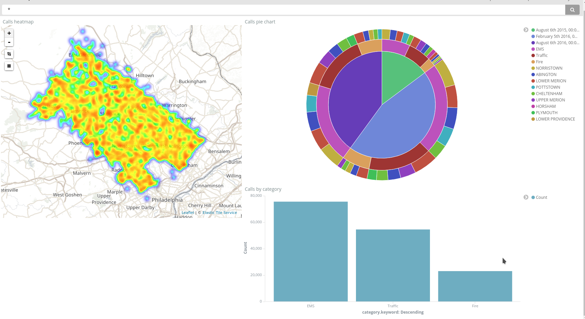

# 911 Calls avec ElasticSearch

## Import du jeu de données

Pour importer le jeu de données, complétez le script `import.js` (ici aussi, cherchez le `TODO` dans le code :wink:).

Exécutez-le ensuite :

```bash
npm install
node import.js
```

Vérifiez que les données ont été importées correctement grâce au shell (le nombre total de documents doit être `153194`) :

```
GET calls/_count
```

## Requêtes

À vous de jouer ! Écrivez les requêtes ElasticSearch permettant de résoudre les problèmes posés.


### Compter le nombre d'appels autour de Lansdale dans un rayon de 500 mètres
```
POST calls/_count
{
  "query": {
    "bool": {
      "filter": {
      "geo_distance" : {
        "distance" : "500m",
        "location" : [-75.283783, 40.241493]
      }
    }
  }
 }
}
```

### Compter le nombre d'appels par catégorie
```
POST /calls/call/_search
{
    "size": 0,
    "aggs" : {
        "categories" : {
            "terms": {
                "field": "category.keyword"
            }
        }
    }
}
```

### Trouver les 3 mois ayant comptabilisé le plus d'appels

_Note: j'ai utilisé un champ nommé date et non @timestamp, un champ de nom
@timestamp respecterait les conventions de nommage et serait détecté automatiquement
par kibana._
```
POST calls/call/_search
{
    "size": 0,
    "aggs" : {
        "monthsWithTheMostCalls" : {
            "date_histogram" : {
                "field" : "date",
                "interval" : "month",
                "format" : "MM/yyyy",
                "order" : { "_count" : "desc" }
            }
        }
    }
}
```

### Trouver le top 3 des villes avec le plus d'appels pour overdose
```
POST calls/call/_search
{
  "size": 0,
  "query": {
    "match": {
      "subject": "OVERDOSE"
    }
  },
  "aggs": {
    "mostOverdoseCalls": {
      "terms": {
        "field": "township.keyword",
        "size": 3
      }
    }
  }
}
```

## Kibana

Dans Kibana, créez un dashboard qui permet de visualiser :

* Une carte de l'ensemble des appels
* Un histogramme des appels répartis par catégories
* Un Pie chart réparti par bimestre, par catégories et par canton (township)



### Timelion
Timelion est un outil de visualisation des timeseries accessible via Kibana à l'aide du bouton : 

Réalisez le diagramme suivant :


Envoyer la réponse sous la forme de la requête Timelion ci-dessous:  

```
TODO : ajouter la requête Timelion ici
```
